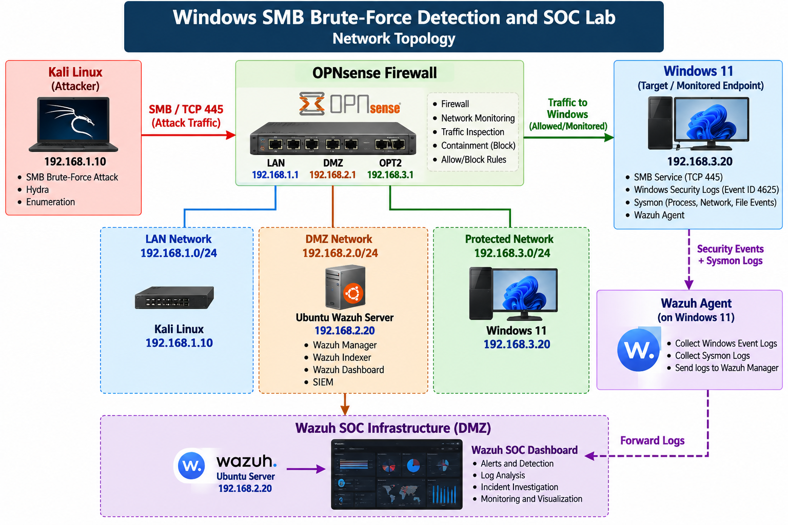

# Windows SMB Brute-Force Detection and SOC Response Lab

## Overview

An authorized hands-on SOC lab demonstrating the detection, investigation, containment, and recovery of SMB authentication brute-force activity.

The lab combines Kali Linux, OPNsense, Windows 11, Sysmon, and Wazuh SIEM to demonstrate an end-to-end SOC workflow.

## Architecture



```text
Kali Linux
192.168.1.10
      |
      | SMB / TCP 445
      v
OPNsense Firewall
      |
      v
Windows 11
192.168.3.20
      |
      | Security Events + Sysmon
      v
Wazuh Agent
      |
      v
Ubuntu Wazuh Server
192.168.2.20
      |
      v
Wazuh SOC Dashboard
